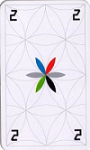
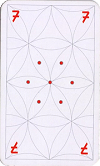
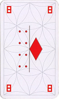
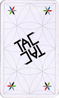

# TAC - a fun browser game for 4 friends  <!-- omit in toc -->
_by_ ***Alexander Knoch*** (2021)

# Table of contents 
- [Table of contents](#table-of-contents)
- [Introduction](#introduction)
- [Used technologies](#used-technologies)
- [Server](#server)
  - [General setup](#general-setup)
  - [Admin information](#admin-information)
- [Frontend](#frontend)
- [Possible improvements](#possible-improvements)
- [Appendix](#appendix)
  - [TAC - basic rules of the game](#tac---basic-rules-of-the-game)
Play online on [playtac.herokuapp.com](http://playtac.herokuapp.com)

# Introduction
TAC is a board game which is played with 4 players separated into 2 teams. Since I'd like to play it with friends not only when we personally meet, but also online (during lockdown) I decided to program it as a **modern web application** using **ReactJs** on the frontend and **Node.Js** on the backend. 

# Used technologies
In this project several modern web development technologies have been used on the backend and the frontend such as:
* `node.js`
* `ReactJs`
* `Cookies` 
* `WebSockets` 
# Server
## General setup ##
The Server is generally running on `node.js`. 
To handle the HTTP request serve the ReactJs frontend and to create or join a room the `express` framework is used.
Once the client is visiting a `WebSocket` connection gets established so that each action of a player directly gets communicated to the server and all other players (e.g. playing a card or moving a ball on the board).

## Admin information ##
Additionally an **admin** area is provided by rendering `ejs` files, which show the administrator the currently active games and on the server and the status of each single game. 

[go up &uarr;](#table-of-contents)

# Frontend

[go up &uarr;](#table-of-contents)

# Possible improvements
To improve _TAC_ following improvements could be implemented: 
* include a database to to store all games and each state ( --> review a game)
* include a point system for friends which play in fixed teams of 2
* the advanced version of __TAC__ has 4 special cards which add to the 100 basic cards --> implement these 4 special cards and there functionalities
* add possibility to join a game as a non-playing observer (maybe having knowledge about hand cards of each player )

[go up &uarr;](#table-of-contents)
# Appendix
## TAC - basic rules of the game
TAC is a game for 4 players which play in 2 teams in a 2vs2 mode against each other.
The **main objective** for each player is to bring all of your **4 balls** in to the game (by playing a *starter card* (*1* or *13*)) and then to **move** it to your **home** (4 ball slots) in the middle of the board. **The team which brings all it's 8 balls to their home slots first wins.**. If you're finished with your 4 balls, you're allowed to help and move the balls of your teammate.  

To move one of your 4 balls you play one of the cards you have in your hand and which are secret to all other players. 
Once you successfully brought all your 4 
There are several "normal" cards which only have the function to move your ball by n-positions. These **normal cards** are:

Then there are 2 cards which enable you to **bring one of your inactive balls** into 
the game: 

  
  

**Special cards are the following:**

    4 - move your ball 4 slots anti-clockwise
&nbsp; &nbsp; &nbsp; 

    7 - move 7x individual single moves ( enables to split moves to different balls and to kick out opponents balls)

&nbsp; &nbsp; &nbsp; 

    8 - next player miss one turn and must dump on of this cards
&nbsp; &nbsp; &nbsp; 

    Trickser - switch 2 balls of your choice on the board
&nbsp; &nbsp; &nbsp; 

    TAC - undo the action of the previous player and re-apply the effect of his/her card
&nbsp; &nbsp; &nbsp; 

For further and more detailed instructions, please refer to the official [rules](https://shop.spiel-tac.de/spielanleitungen).

[go up &uarr;](#table-of-contents)
