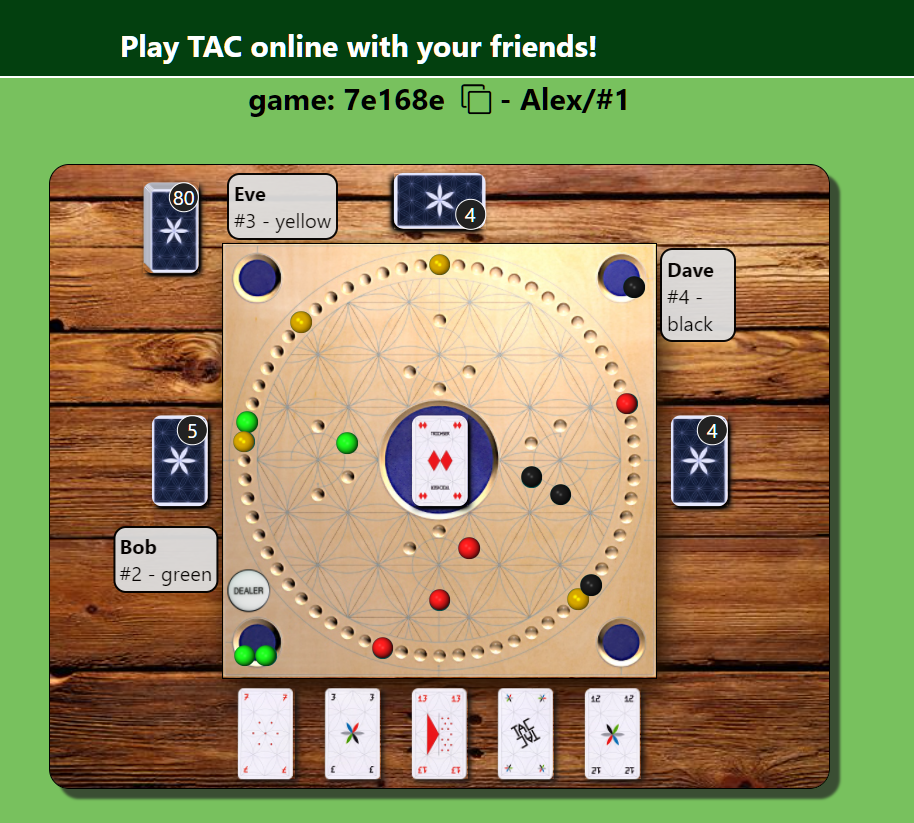
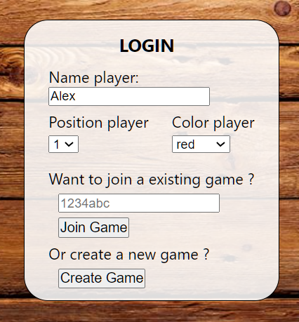
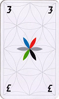
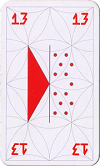
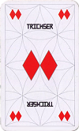

# TAC - a fun browser game for 4 friends  <!-- omit in toc -->
_by_ ***Alexander Knoch*** (2022)

**Play now on https://playtac.herokuapp.com/**

# Table of contents 
- [Table of contents](#table-of-contents)
- [Introduction](#introduction)
- [General overview](#general-overview)
  - [Used technologies](#used-technologies)
- [Server](#server)
  - [General setup](#general-setup)
  - [Model and controller](#model-and-controller)
  - [Admin information](#admin-information)
- [Frontend](#frontend)
  - [Login page](#login-page)
  - [Game](#game)
    - [GameProvider](#gameprovider)
    - [SocketProvider](#socketprovider)
    - [Board.js](#boardjs)
- [Possible improvements](#possible-improvements)
- [Appendix](#appendix)
  - [Slot labelling](#slot-labelling)
  - [TAC - Basic rules of the game](#tac---basic-rules-of-the-game)
Play online on [playtac.herokuapp.com](http://playtac.herokuapp.com)

# Introduction
TAC is a board game that is played with 4 players separated into 2 teams. Since I've liked to play it with friends not only when we meet in person, but also online (during lockdown), I've decided to transfer it into a **modern web application** using **ReactJs** on the frontend and **Node.Js** on the backend. Communication in between is mainly realized using **WebSockets**.

If you're interested in the rules of the game check the appendix &rarr; 
["basic rules of the game"](#tac---basic-rules-of-the-game) or visit the official [TAC site](https://shop.spiel-tac.de/spielanleitungen) for detailed rules.

Start playing now under **https://playtac.herokuapp.com/**

# General overview

## Used technologies
In this project, several modern web development technologies have been used on the backend and the frontend such as:
* `node.js`
* `express`
* `EJS`
* `ReactJs`
* `WebSockets` 

# Server
## General setup ##
The Server is running on `node.js` using the well-known web application framework `express` to server the production build of the `ReactJs` application. To handle the login data from the user ( username, color, join or create a new game) standard HTTP communication is used.
Once the client gets redirected to a specific game page, a `WebSocket` connection gets established so that each action of a player directly gets communicated to the server and all other players (e.g. playing a card or moving a ball on the board).

## Model and controller ##

The core of the backend consists of the **controller modules** and the **model**.
There are two controller implemented: 
- gameController
- playerController

  

Both of them are being required by the HTTP modules `server.js` and `router.js`, as well as the WebSocket module `wsConnect.js`.
Each incoming input (HTTP requests or WebSocket events) are handled by those two controller modules. 
Those on the other hand are communicating further with the **model**.
The **model** is using 4 different classes:
- game model
- player model
- ball model
- cards model

Doing so the **model** keeps track of:
 - existing games  
 - players and where they are playing
 - ball positions in each game
 - card status (hand cards, trash cards, shuffled deck)
 - dealer position

The interaction between communication modules, controller modules and the model can be seen in the figure to the right.

## Admin information ##
Additionally, an **admin** area is provided by rendering `ejs` files, which show the administrator the currently active games on the server and the status of every single game. 

[go up &uarr;](#table-of-contents)

# Frontend

The frontend is programmed using `ReactJs` which made it very easy to dynamically re-render the page as soon as any state changes (due to actions by the user himself or updates sent from the server through the `WebSocket` connection).

## Login page

  

When visiting the page, the user will see the **LoginPage**. One of your friends needs to create a new game by clicking on `create game` (after entering name and selecting color and position on the board). In response, they receive a link from the server (answer to a POST request) which includes the 6-digit **game id**. This **game id** is then shared with your friends so that they can join the same game by clicking on `join game`. At this point, the server performs a check if the position or color is already taken for the game in question.

  
  

If there's neither a collision on the color selection nor the position selection the server will provide a link (answer to POST) to the client which leads to the game with the desired **game id**.

## Game 

The React-App itself contains 3 major parts which are visualized in the structure overview figure below:

1. **GameProvider** 
2. **SocketProvider** 
3. **Board.js** reactjs-file

### GameProvider

The **GameProvider** is the first layer of the React-App and contains the **game model** which manages all basic states of the current game such as player info, hand cards, trash cards, dealer position and ball positions. **Important** to note here is that **all positions** are stored in a **global**
manner similar like the server does. This means that a ball position is not stored as a point on the x/y-coordinate system,
but is stored using the **96 ball slots** of the board. Each slot on the board has its own unique id. 
For details please refer to [Slot labelling](#slot-labelling) in the **Appendix**.

### SocketProvider

The **socketProvider** is the second layer of the React-App. It is activated as soon as the player joined or created a game.
In here a **WebSocket** connection to the server gets established and several listeners are defined (according to the emit events of the server). This **WebSocket** is then provided to all **ViewComponents** which need to trigger an event back to the server (e.g. when moving a ball or playing a specific card).

### Board.js

The **Board.js** file is the core ReactJs component which includes all subComponents (balls, cards, dealerButton, clickable area in the center of the board, etc.). 

One major objective for this project regarding the frontend was that each player sees the complete board in such a way that he/she is "sitting" on the bottom of the screen. 
This is fully independent of the actual player position (1-4). So if you are player 3 then on the left would be player 4, on the top player 1 and on your right player 2.

Therefore **Board.js** has 2 main tasks to perform so that all 16 balls are visualized at their correct position:
1. from the model data provided by **GameProvider** calculate the x/y-position of each ball in the **absolute coordinate system** which is equal to the perspective of player 1 ( ball in slot #0 is on the bottom, ball in slot #16 is on the left, etc) 
2. perform a **coordinate transformation** according to the individual player position:
    - player 1: do nothing
    - player 2: rotate by 90°
    - player 3: rotate by 180°
    - player 4: rotate by 270°

Similar considerations are taken to correctly visualize all actions involving the cards. Let it be the playing action or the swapping of cards after each round of dealing new cards.

[go up &uarr;](#table-of-contents)

# Possible improvements
To improve _TAC_ the following improvements could be implemented: 
* include a database to store all games and each state ( --> review a game)
* include a point system for friends who play in fixed teams of 2
* the advanced version of __TAC__ has 4 special cards which add to the 100 basic cards --> implement these 4 special cards and their functionalities
* add the possibility to join a game as a non-playing observer (maybe having knowledge about hand cards of each player )

[go up &uarr;](#table-of-contents)

# Appendix

## Slot labelling

All the slots for the balls have a unique id to identify them and to give each ball on the board a global position.
There are 3 categories of slots:
- the **64 ring slots**
- the 4x4 **base slots** in the corners and 
- the 4x4 **home slots** near the center of the board

Slots **#0-#63** are the ring slots where **#0** is in front of **player 1** (#16 is in front of player 2, #32 in front of player 3 and #48 in front of player 4).

For slots **#71-#78**, **#81-#88**, **#91-#98** and **#101-#108** the following definitions applies:

|slot id | description |
|--------|-------------|
|71-74|base slots for player 1|
|75-78|home slots for player 1|
|81-84|base slots for player 2|
|85-88|home slots for player 2|
|91-94|base slots for player 3|
|95-98|home slots for player 3|
|101-104|base slots for player 4|
|105-108|home slots for player 4|
## TAC - Basic rules of the game

TAC is a game for 4 players who are playing in 2 teams in a 2vs2 mode against each other.
The **main objective** for each player is to bring all of their **4 balls** into their **4 home slots** by moving them around the board playing cards with different effects on the board. **The team which brings all of its 8 balls into their home slots first wins the game**. As soon as one player of a team finished their 4 balls, they are allowed to help and move the balls of their teammate to bring home all of their remaining balls.  

To move one of your 4 balls you play one of the cards you have in your hand and which are secret to all other players. 
Once you successfully brought all your 4 
There are several "normal" cards which only have the function to move your ball by n-positions. These **normal cards** are:

  
  
  
  
  
  
  

Then there are 2 cards which enable you to **bring one of your inactive balls** into 
the game: 

  
  

**Special cards are the following:**

    4 - move your ball 4 slots anti-clockwise
&nbsp; &nbsp; &nbsp; 

    7 - move 7x individual single moves ( enables to split moves to different balls and to kick out opponents balls)

&nbsp; &nbsp; &nbsp; 

    8 - next player miss one turn and must dump one of their cards
&nbsp; &nbsp; &nbsp; 

    Trickser - switch any 2 balls of your choice on the board
&nbsp; &nbsp; &nbsp; 

    TAC - undo the action of the previous player and re-apply the effect of their card
&nbsp; &nbsp; &nbsp; 

For further and more detailed instructions, please refer to the official [rules](https://shop.spiel-tac.de/spielanleitungen).

[go up &uarr;](#table-of-contents)
